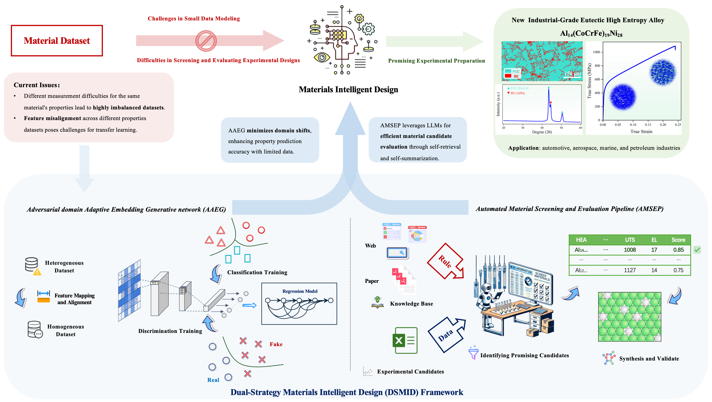

# DSMID

**Paper Title:** ***From Small Data Modeling to Large Language Model Screening: A Dual-Strategy for Materials Intelligent Design***

> In our paper, the material cost is represented as $\text{Al}_{14}(\text{CoCrFe})_{19}\text{Ni}_{28}$. The total composition does not sum to 100% due to the use of the `round()` function. The complete composition is as follows: $\text{Al}_{14.28}(\text{CoCrFe})_{19.05}\text{Ni}_{28.57}$.


The **Dual-Strategy Materials Intelligent Design Framework (DSMID)** is proposed to tackle the challenges of small data in materials intelligent design. By enhancing property prediction and efficiently screening experimental candidates, DSMID successfully identifies a new eutectic High Entropy Alloy with significantly improved plasticity and strength, providing a powerful solution for material intelligent design in data-constrained scenarios.


### Highlight

- **Expanded statistics on elements were used to densify sparse material composition matrices and align constituent features of the source and target domains.**
- **A coupled feature representation and adversarial generation domain adaptation network was proposed to narrow the domain shift between various target performance HEAs datasets.**
- **Covariance distance and residual reverse gradient connections were introduced to aid the feature representation network in better HEAs component characterization using limited data.**
- **Based on the obtained high-precision performance predictor and [the candidate experimental scheme selection pipeline based on GPT-4](https://github.com/yuyouyu32/MaterialFilter), HEAs compositions with exceptional performance were reverse-engineered and experimentally validated.**

### Abstract

Small data in materials present significant challenges to constructing highly accurate machine learning models, severely hindering the widespread implementation of data-driven materials intelligent design. In this study, we introduce the Dual-Strategy Materials Intelligent Design Framework (DSMID), which integrates two innovative methods. The Adversarial domain Adaptive Embedding Generative network (AAEG) transfers data between related property datasets, even with only 90 data points, enhancing material composition characterization and improving property prediction. Additionally, to address the challenge of screening and evaluating numerous alloy designs, we implemented the Automated Material Screening and Evaluation Pipeline (AMSEP). This pipeline utilizes large language models with extensive domain knowledge to efficiently identify promising experimental candidates through self-retrieval and self-summarization. Experimental findings demonstrate that this approach effectively identifies and prepares new eutectic High Entropy Alloy (EHEA), notably $\text{Al}{14.28}\text{(CoCrFe)}{19.05}\text{Ni}_{28.57}$, achieving an ultimate tensile strength of 1085 MPa and 24\% elongation without heat treatment or extra processing. This demonstrates significantly greater plasticity and equivalent strength compared to the typical as-cast eutectic HEA $\text{AlCoCrFeNi}_{2.1}$. The DSMID framework, combining AAEG and AMSEP, addresses the challenges of small data modeling and extensive candidate screening, contributing to cost reduction and enhanced efficiency of material design. This framework offers a promising avenue for intelligent material design, particularly in scenarios constrained by limited data availability. All data and code are available at \href{https://github.com/yuyouyu32/DSMID}{https://github.com/yuyouyu32/DSMID}.


## Installation

The following paragraph provides an installation guide for using **pip** in order to install Python packages that is utilized in our project.

To install the package using pip, first ensure that pip is installed on your system. If you don't have pip, you can download and install it using the instructions provided on the pip website. The python version utilized in our research is `3.8.12`. Users may utilize management tools such as conda or pyenv to download the corresponding version of python. Alternatively, the desired version of python can be directly downloaded from [click here]( https://www.python.org/downloads/release/python-3812/).

It is noteworthy that we utilized `NVIDIA's V100 GPU` during our training process, with a CUDA version of `11.3` and a pytorch version of `1.10.0`. It was not possible to correctly identify the specific versions of torch and cuda via the `pip install -r` command, so we provided supplementary pip installation instructions for torch. However, users also have the option to select a pytorch version corresponding to their own CUDA version.

``` shell
> pip install -r requirements.txt
# CUDA 11.3 & torch 1.10.0
> pip install torch==1.10.0+cu113 torchvision==0.11.0+cu113 torchaudio==0.10.0 -f https://download.pytorch.org/whl/torch_stable.html
```

## Data

All datasets utilized throughout this manuscript can be found in the `Data` folder. The `HV_O_data.csv` file represents the source domain dataset with a target performance of HV. The `EL_HT_ALL.csv` and `UTS_HT_ALL.csv` files represent the target domain datasets with a target performance of UTS and EL. Files in `./Data/Imgs` were converted to grayscale images from material composition information in the original datasets by utilizing the `DataTransform.py` code from [Transformer](https://github.com/yuyouyu32/MCVN/blob/main/Data/DataTransform.py).

## MyDataLoader：

My Dataloader class returns a total of six parameters: three for the source domain `X, Y, and bucket label` and three for the target domain `X, Y, and bucket label`. An example of a function call is provided below.

```python
dataloader = MyDataLoader(source_img='./Data/Imgs/Schedule_HV.csv', orginal_data='./Data/HV_O_data.csv', targets='Hardness (HV)',
                          target_img='./Data/Imgs/Schedule_UTS.csv', target_data='./Data/UTS_HT_ALL.csv', t_target='UTS')
source_domain_x, source_domain_y, source_domain_class, target_domain_x, target_domain_y, target_domain_class = dataloader.get_dataset(if_norm=True, get_scaler=False)
print(source_domain_x.shape, source_domain_y.shape, source_domain_class.shape)
print(target_domain_x.shape, target_domain_y.shape, target_domain_class.shape)
```

## Train


The training process for AAEG can be initiated by using the command `python AAEG.py --para xx`, where the parameter `--para` can be utilized to set corresponding training parameters. The relevant training options can be viewed using the `--help` guide.

```shell
> python AAEG.py --help
Usage: AAEG.py [OPTIONS]

Options:
  --batch_size INTEGER          BatchSize of AAEG Training process
  --nz INTEGER                  Noise size used in G-generated images
  --ngf INTEGER                 Size of F-network output
  --ndf INTEGER                 D network extraction feature output size
  --nepochs INTEGER             Numbers of training epochs
  --lr FLOAT                    Learning rate
  --beta1 FLOAT                 beta1 for adam.
  --gpu INTEGER                 If use GPU for training of testing. 1--used,
                                -1--not used
  --adv_weight FLOAT            weight for adv loss
  --lrd FLOAT                   Learning rate decay value
  --alpha FLOAT                 multiplicative factor for target adv. loss
  --earlystop_patience INTEGER  Early stop mechanism patience epochs
  --model_save_path TEXT        F C D G network storage folder for training
  --logs_path TEXT              Tensorboard log save path
  --bucket_result_path TEXT     C and D network bucketing results storage path
  --help                        Show this message and exit.
  
> python AAEG.py --batch_size 512 --nz 512 --ngf 64 --ndf 64 --nepochs 200 --lr 0.00008 --beta1 0.8 --gpu 1 --adv_weight 1.5 --lrd 0.0001 --alpha 0.1 --earlystop_patience 200 --model_save_path './Checkpoints' --logs_path './Logs' --bucket_result_path './bucket_result.json'
-----------------------AAEG Traininig~-----------------------
[ 50/200] train_loss: 1.07395 train_score: 0.43580 tgt_class_loss: 0.84406 tgt_class_score: 0.78889 CORAL_LOSS: 0.0241808688 
[100/200] train_loss: 1.07108 train_score: 0.43580 tgt_class_loss: 0.78605 tgt_class_score: 0.78889 CORAL_LOSS: 0.0385929549 
[150/200] train_loss: 1.06892 train_score: 0.43580 tgt_class_loss: 0.78363 tgt_class_score: 0.78889 CORAL_LOSS: 0.0370798096 
[200/200] train_loss: 1.06695 train_score: 0.43580 tgt_class_loss: 0.78102 tgt_class_score: 0.78889 CORAL_LOSS: 0.0477342071 
-----------------------Train finished!-----------------------
-----------------------Model save in `./Checkpoints`-----------------------
-----------------------Tensorboard logs save in `./Logs`-----------------------
-----------------------C and D network bucketing results save in `./bucket_result.json`-----------------------
```

## Visulization

The training process for AAEG can be visualized using the command `tensorboard --logdir=xxx`. Additional visualization tools can be found in the [TensorBoard framework](https://www.tensorflow.org/tensorboard).

```shell
> tensorboard --logdir='./Logs_Pre'
NOTE: Using experimental fast data loading logic. To disable, pass
    "--load_fast=false" and report issues on GitHub. More details:
    https://github.com/tensorflow/tensorboard/issues/4784

I0404 21:55:16.224004 140336020473600 plugin.py:429] Monitor runs begin
Serving TensorBoard on localhost; to expose to the network, use a proxy or pass --bind_all
TensorBoard 2.10.0 at http://localhost:6006/ (Press CTRL+C to quit)
```


## Eval

The testing process for AAEG can be initiated by using the command `python eval.py --para xx`, where the parameter `--para` can be utilized to set corresponding testing parameters. The relevant testing options can be viewed using the `--help` guide.

```shell
> python eval.py --help
Usage: eval.py [OPTIONS]

Options:
  --batch_size INTEGER           BatchSize of AAEG Training process
  --nz INTEGER                   Noise size used in G-generated images
  --ngf INTEGER                  Size of F-network output
  --ndf INTEGER                  D network extraction feature output size
  --nepochs INTEGER              Numbers of training epochs
  --lr FLOAT                     Learning rate
  --beta1 FLOAT                  beta1 for adam.
  --gpu INTEGER                  If use GPU for training of testing. 1--used,
                                 -1--not used
  --adv_weight FLOAT             weight for adv loss
  --lrd FLOAT                    Learning rate decay value
  --alpha FLOAT                  multiplicative factor for target adv. loss
  --num_nodes INTEGER            Number of nodes per layer of edRVFL model
  --regular_para FLOAT           Regularization parameter. of edRVFL model
  --weight_random_range INTEGER  Range of random weights
  --bias_random_range INTEGER    Range of random bias
  --num_layer INTEGER            Number of hidden layersNumber of hidden
                                 layers
  --save_path TEXT               The predict score result save path
  --model_path TEXT              Pre-Trained F newtwork .pt file path
  --help                         Show this message and exit.
  
 > python eval.py --batch_size 512 --nz 64 --ngf 64 --ndf 64 --nepochs 5000 --lr 0.00008 --beta1 0.8 --gpu 1 --adv_weight 1.5 --lrd 0.0001 --alpha 0.1 --num_nodes 128 --regular_para 1 --weight_random_range 10 --bias_random_range 10 --num_layer 32 --save_path './eval_results.json' --model_path './CheckPoints_Pre/F.pt'
 
 -----------------HV Training-----------------

-----------------HV R2 0.9190935481302166-----------------


-----------------UTS Training-----------------

-----------------HV R2 0.8036386483185044-----------------


-----------------EL Training-----------------

-----------------HV R2 0.8499984587706788-----------------


Performance          R2       MAPE         MSE
-------------  --------  ---------  ----------
HV             0.919094  0.0754943    1496.7
UTS            0.803639  0.127405     15675
EL             0.849998  1.2308       48.3007
```

## Eval

Details of the process for screening candidate solutions for materials experiments based on `LLMs` can be found [here](https://github.com/yuyouyu32/MaterialFilter)

